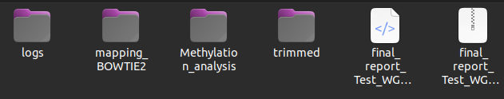
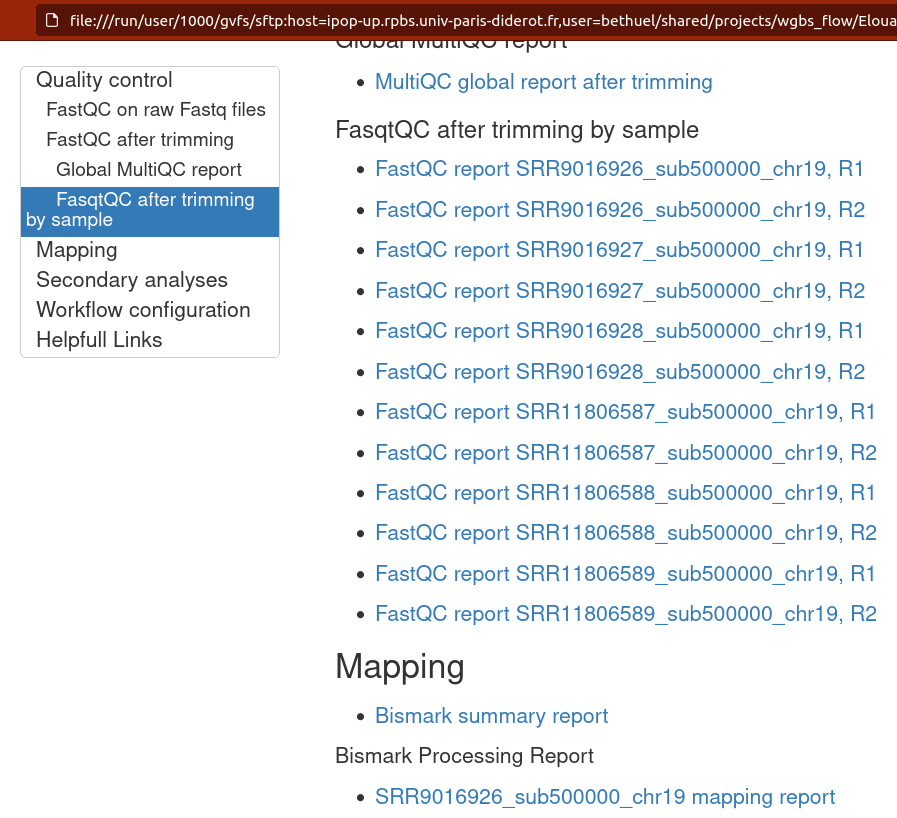
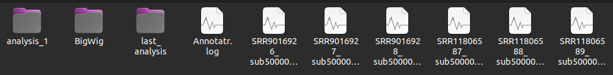
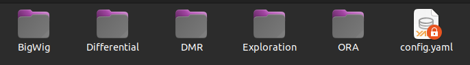

# Workflow architecture

## Folders organisation 


The `configs` folder contains all the configurations files.
Files present here are the only ones you need to modify to use the workflow.

```bash
.
├── cluster_config_ifb.yaml
├── cluster_config_ipop.yaml
├── cluster_config.yaml
├── config_nanopore.yaml
├── config_wgbs.yaml
├── config.yaml
├── metadata_annot.tsv
└── metadata.tsv
```

The `scripts` folder contains all the scripts necessary for the workflow's operation, except for the Snakemake scripts. Please do not touch anything here. 

```bash
.
├── Annotatr.R
├── build_DAG_graphes.sh
├── check_config_path.py
├── colors.yaml
├── DMR.Rmd
├── DMR_RRBS.Rmd
├── edc_workflows.py
├── final_report_comp.Rmd
├── final_report.Rmd
├── getquota2.sh
├── images
│   ├── bibs_logo_.png
│   ├── cpg_annot.jpeg
│   └── gene.jpeg
├── main_cluster.py
├── MKit_BedgraphDiff.R
├── MKit_Bedgraph.R
├── MKit_BSMAP.R
├── MKit_diff_bed.R
├── Mkit_differential.Rmd
├── MKit_diff_fig.R
├── MKit_Exploration_all.Rmd
├── MKit_Exploration.Rmd
├── MKit_prep_differential.R
├── MKit_prep_nanopore.R
├── MKit_prep_WGBS.R
├── ORA.py
├── parse_yaml.sh
├── parsinglog_flow.py
├── parsinglog.py
├── prep_array.R
├── reporting.py
├── run_rule.sh
├── search_bank.sh
└── test_bam.R
```

The  `workflow ` folder contains all the Snakemake scripts ".rules". Please do not touch anything here.

```bash
.
├── config_main_schema.yaml
├── config_mapping_schema.yaml
├── config_methylator_schema.yaml
├── config_QC_schema.yaml
├── config_trim_schema.yaml
├── differential.rules
├── exploration.rules
├── fastq_dump_QC.rules
├── mapping.rules
├── nanopore.yml
├── report.rules
├── samples.schema.yaml
├── Singularity_ncbi
├── trim.rules
└── wgbsflow.yaml
```

The  ` TestDataset `  folder contains all the files necessary to test the workflow with a small dataset.    

```bash
.
├── bam_nanopore
│   ├── RRMS_2marks_NP95
│   └── RRMS_2marks_WT
├── configs
│   ├── config_nanopore.yaml
│   ├── config_wgbs.yaml
│   ├── metadata_nano2.tsv
│   ├── metadata_nano.tsv
│   └── metadata_wgbs.tsv
├── fastq
│   ├── select_sam.sh
│   ├── SRR11806587_sub500000_chr19_R1.fastq.gz
│   ├── SRR11806587_sub500000_chr19_R2.fastq.gz
│   ├── SRR11806588_sub500000_chr19_R1.fastq.gz
│   ├── SRR11806588_sub500000_chr19_R2.fastq.gz
│   ├── SRR11806589_sub500000_chr19_R1.fastq.gz
│   ├── SRR11806589_sub500000_chr19_R2.fastq.gz
│   ├── SRR9016926_sub500000_chr19_R1.fastq.gz
│   ├── SRR9016926_sub500000_chr19_R2.fastq.gz
│   ├── SRR9016927_sub500000_chr19_R1.fastq.gz
│   ├── SRR9016927_sub500000_chr19_R2.fastq.gz
│   ├── SRR9016928_sub500000_chr19_R1.fastq.gz
│   └── SRR9016928_sub500000_chr19_R2.fastq.gz
└── my_bank
    ├── cpgIslandExt.mm39.bed
    ├── cpgIslandExt.mm39_mini.bed
    ├── gencode.vM27.annotation_chr19.gtf
    ├── gencode.vM27.annotation_chr19_mini.gtf
    ├── mm39_chr19_mini.fa
    └── rrms_mm39_mini.bed
```


The `my_bank` folder is an empty directory. It is used to store reference genomes and annotation files (FASTA, GTF, BED, etc.) for different species when the required files are not available in the banks present on your cluster (refer to [annotation](annotations.md) ).  

## Folders organisation after run 

After launching the workflow, new folders are created. One folder for easily usable results (name by default `Results`, which you can name as you wish in the configuration file. One folder for 'heavy' results (name by default `Big_Data`) , also nameable as you wish. A `log folder` , and a `slurm_output folder`  .

Exemple of folders organisation after launching 


The `Results` folder contains the results of each project. Within each project folder, the results are organized into separate folders corresponding to the different stages of the workflow: fastq download + QC, trimming + QC, mapping + QC, and methylation analysis.

Example of the organization of the results 


Additionally, at the end of the workflow execution, if you have chosen to generate a report, a zipped and timestamped folder (e.g., `final_report_Test_WGBS_20240828T1023.tar.gz`) is created to easily share your results. This folder contains all the HTML files (QC + statistical analyses). This folder is accompanied by a timestamped HTML file (e.g., `final_report_Test_WGBS_20240828T1023.html`), which contains links to the various HTML reports.

Example list of files contained in final_report_(project)_(timestamp).tar.gz


Example of a file: final_report_(project)_(timestamp).html


!!! tip
        The final report folder is unique due to its timestamp, making it easier to version your analyses.
        The final report file allows you to navigate more easily through your results.


In the `Methylation_analysis` section of the results, to facilitate the ability to test numerous parameterizations on the same dataset, if you rerun the workflow (for the same project) after modifying a parameter in the Methylation Analysis section of the configuration file, a new methylation analysis is performed. This analysis is stored in the `last_analysis` folder. For each new analysis, a `last_analysis` folder is created, and the previous folders are renamed `analysis_(number)`.



To retain information about the parameterization of your analyses, each `last_analysis` or `analysis_(number)` folder contains a clone of the configuration file that was used to generate the results. This way, it is possible to conduct multiple methylation analyses without losing track. The methylation analyses are organized according to the different stages of the analyses, namely: exploration `Exploration`, differential analysis in CpG and Tiles `Differential` , differential analysis in regions `DMR `, and enrichment analysis `ORA`. Additionally, there is a `BigWig` folder containing bigwig data of the methylation difference (in CpG) for each comparison.




