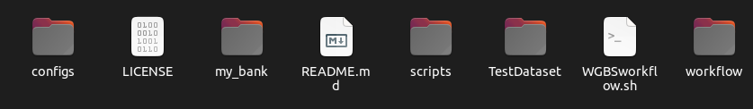

# Workflow Description 

## Utilisation 

Methylator allows the analysis of DNA methylation data from two types of sources:    
- Sequencing data processed with Sodium Bisulfite treatment (BS-seq , WGBS and RRBS)
- Nanopore sequencing data.      

!!! note
    Currently, Methylator is not compatible with microarray data.


In the case of BS-seq data, the workflow begins with files in FASTQ format. It performs all the standard steps to obtain methylation count tables (QC, trimming, mapping), as well as step-by-step analyses. In the case of nanopore data, the workflow starts with files in .BAM format generated by basecalling. The second part of the workflow, which focuses on methylation analysis, is common to both types of data.  

**So, Methylator serves as a benchmarking tool to compare these two methods and assist in parameter selection for your analysis**


## Folders organisation 



The `configs` folder contains all th configurations fils. 
```bash
.
├── cluster_config_ifb.yaml
├── cluster_config_ipop.yaml
├── cluster_config.yaml
├── config_nanopore.yaml
├── config_wgbs.yaml
├── config.yaml
├── metadata_annot.tsv
└── metadata.tsv
```

The `scripts` folder contains all the scripts necessary for the workflow's operation, except for the Snakemake scripts.    

```bash
.
├── Annotatr.R
├── build_DAG_graphes.sh
├── check_config_path.py
├── colors.yaml
├── DMR.Rmd
├── DMR_RRBS.Rmd
├── edc_workflows.py
├── final_report_comp.Rmd
├── final_report.Rmd
├── getquota2.sh
├── images
│   ├── bibs_logo_.png
│   ├── cpg_annot.jpeg
│   └── gene.jpeg
├── main_cluster.py
├── MKit_BedgraphDiff.R
├── MKit_Bedgraph.R
├── MKit_BSMAP.R
├── MKit_diff_bed.R
├── Mkit_differential.Rmd
├── MKit_diff_fig.R
├── MKit_Exploration_all.Rmd
├── MKit_Exploration.Rmd
├── MKit_prep_differential.R
├── MKit_prep_nanopore.R
├── MKit_prep_WGBS.R
├── ORA.py
├── parse_yaml.sh
├── parsinglog_flow.py
├── parsinglog.py
├── prep_array.R
├── reporting.py
├── run_rule.sh
├── search_bank.sh
└── test_bam.R
```

The  `workflow ` folder contains all the Snakemake scripts ".rules".

```bash
.
├── config_main_schema.yaml
├── config_mapping_schema.yaml
├── config_methylator_schema.yaml
├── config_QC_schema.yaml
├── config_trim_schema.yaml
├── differential.rules
├── exploration.rules
├── fastq_dump_QC.rules
├── mapping.rules
├── nanopore.yml
├── report.rules
├── samples.schema.yaml
├── Singularity_ncbi
├── trim.rules
└── wgbsflow.yaml
```

The  ` TestDataset `  folder contains all the files necessary to test the workflow with a small dataset.    

```bash
.
├── bam_nanopore
│   ├── RRMS_2marks_NP95
│   └── RRMS_2marks_WT
├── configs
│   ├── config_nanopore.yaml
│   ├── config_wgbs.yaml
│   ├── metadata_nano2.tsv
│   ├── metadata_nano.tsv
│   └── metadata_wgbs.tsv
├── fastq
│   ├── select_sam.sh
│   ├── SRR11806587_sub500000_chr19_R1.fastq.gz
│   ├── SRR11806587_sub500000_chr19_R2.fastq.gz
│   ├── SRR11806588_sub500000_chr19_R1.fastq.gz
│   ├── SRR11806588_sub500000_chr19_R2.fastq.gz
│   ├── SRR11806589_sub500000_chr19_R1.fastq.gz
│   ├── SRR11806589_sub500000_chr19_R2.fastq.gz
│   ├── SRR9016926_sub500000_chr19_R1.fastq.gz
│   ├── SRR9016926_sub500000_chr19_R2.fastq.gz
│   ├── SRR9016927_sub500000_chr19_R1.fastq.gz
│   ├── SRR9016927_sub500000_chr19_R2.fastq.gz
│   ├── SRR9016928_sub500000_chr19_R1.fastq.gz
│   └── SRR9016928_sub500000_chr19_R2.fastq.gz
└── my_bank
    ├── cpgIslandExt.mm39.bed
    ├── cpgIslandExt.mm39_mini.bed
    ├── gencode.vM27.annotation_chr19.gtf
    ├── gencode.vM27.annotation_chr19_mini.gtf
    ├── mm39_chr19_mini.fa
    └── rrms_mm39_mini.bed
```


The `my_bank` folder is an empty directory. It is used to store reference genomes and annotation files (FASTA, GTF, BED, etc.) for different species when the required files are not available in the banks present on your cluster (refer to [annotation](annotations.md) ).  

Après avoir lancer le workflow, de nouveaux dossiers sont créés. 
Un dossier pour les résultats facilement exploitable. 
Un dossier pour les résultats 'lourds'
Un dossier log.
Un dossier slurm_output. 


## Main scripts 

Methylator is launched as a python script named `main_cluster.py` which calls the workflow manager named [Snakemake](https://snakemake.readthedocs.io/en/stable/snakefiles/rules.html). 
Snakemake will execute rules that are defined in `workflow/xxx.rules` and distribute the corresponding jobs to the computing nodes via [SLURM](https://ifb-elixirfr.gitlab.io/cluster/doc/slurm/slurm_user_guide/). 


On the cluster, the main python script is launched via the shell script `Workflow.sh`,
which basically contains only one command `python main_cluster.py` (+ loading of basic modules and information about the run).
