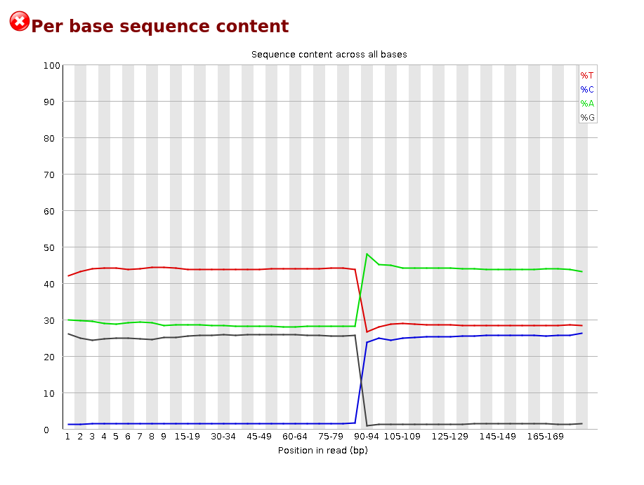

# Extra help! 

## How to follow your jobs

### Running jobs

You can check the jobs that are running using `squeue`.

```
[username@clust-slurm-client Methylator]$ squeue --me
```

### Information about past jobs

The `sacct` command gives you information about past and running jobs. The documentation is [here](https://slurm.schedmd.com/sacct.html). You can get different information with the `--format` option. For instance: 

```
[username@clust-slurm-client Methylator]$ sacct --format=JobID,JobName,Start,CPUTime,MaxRSS,ReqMeM,State
       JobID    JobName               Start    CPUTime     MaxRSS     ReqMem      State 
------------ ---------- ------------------- ---------- ---------- ---------- ---------- 
...
9875767          BigWig 2020-07-27T16:02:48   00:00:59               80000Mn  COMPLETED 
9875767.bat+      batch 2020-07-27T16:02:48   00:00:59     87344K    80000Mn  COMPLETED 
9875768         BigWigR 2020-07-27T16:02:51   00:00:44               80000Mn  COMPLETED 
9875768.bat+      batch 2020-07-27T16:02:51   00:00:44     85604K    80000Mn  COMPLETED 
9875769             PCA 2020-07-27T16:02:52   00:01:22                2000Mn  COMPLETED 
9875769.bat+      batch 2020-07-27T16:02:52   00:01:22    600332K     2000Mn  COMPLETED 
9875770         multiQC 2020-07-27T16:02:52   00:01:16                2000Mn  COMPLETED 
9875770.bat+      batch 2020-07-27T16:02:52   00:01:16    117344K     2000Mn  COMPLETED 
9875773        snakejob 2020-07-27T16:04:35   00:00:42                2000Mn  COMPLETED 
9875773.bat+      batch 2020-07-27T16:04:35   00:00:42     59360K     2000Mn  COMPLETED 
9875774             DEA 2020-07-27T16:05:25   00:05:49                2000Mn    RUNNING 
```

Here you have the job ID and name, its starting time, its running time, the maximum RAM used, the memory you requested (it has to be higher than MaxRSS, otherwise the job fails, but not much higher to allow the others to use the resource), and job status (failed, completed, running). 

**Add `-S MMDD` to have older jobs (default is today only).** 

```
[username@clust-slurm-client Methylator]$ sacct --format=JobID,JobName,Start,CPUTime,MaxRSS,ReqMeM,State -S 0518
```

### Cancelling a job
If you want to cancel a job: scancel job number

```
[username@clust-slurm-client Methylator]$ scancel 8016984
```

Nota: when snakemake is working on a folder, this folder is locked so that you can't start another DAG and create a big mess. If you cancel the main job, snakemake won't be able to unlock the folder (see [below](#folder-locked)). 

## Having errors? 
To quickly check if everything went fine, you have to check the main log. If everything went fine you'll have :

```
???
```

If not, you'll see a summary of the errors: 
```
??????
```

And you can check the problem looking as the specific log file, here `logs/20231104T0921_mapping.txt` 
```
???
```
You can have the description of the error in the SLURM output corresponding to the external jobid, here 13605307: 

```
[username @ clust-slurm-client Methylator]$ cat slurm_output/slurm-13605307.out
```

## Common errors

### Error starting gedit on IFB
If you encounter an error starting gedit

```
[unsername @ clust-slurm-client 16:04]$ ~ : gedit toto.txt
(gedit:6625): Gtk-WARNING **: cannot open display: 
```

Be sure to include `-X` when connecting to the cluster (`-X` option is necessary to run graphical applications remotely).
Use : 

```
You@YourComputer:~$ ssh -X unsername@core.cluster.france-bioinformatique.fr
```

or 

```
You@YourComputer:~$ ssh -X -o "ServerAliveInterval 10" unsername@core.cluster.france-bioinformatique.fr
```

The option `-o "ServerAliveInterval 10"` is facultative, it keeps the connection alive even if you're not using your shell for a while. 


### Initial QC fails

If you don't get MultiQC `report_quality_control.html` report in `results/EXAMPLE/fastqc`, you may have some fastq files not fitting the required format:
- SampleName_R1.fastq.gz and SampleName_R2.fastq.gz for pair-end data, 
- SampleName.fastq.gz for single-end data.

Please see [how to correct a batch of FASTQ files](#quickly-change-fastq-names). 


### Memory 
I set up the memory necessary for each rule, but it is possible that big datasets induce a memory excess error. In that case the job stops and you get in the corresponding Slurm output something like this: 

```
slurmstepd: error: Job 8430179 exceeded memory limit (10442128 > 10240000), being killed
slurmstepd: error: Exceeded job memory limit
slurmstepd: error: *** JOB 8430179 ON cpu-node-13 CANCELLED AT 2020-05-20T09:58:05 ***
Will exit after finishing currently running jobs.
```

In that case, you can increase the memory request by modifying in `workflow/resources.yaml` the `mem` entry corresponding to the rule that failed. 

```yaml
[username@clust-slurm-client Methylator]$ cat workflow/resources.yaml
__default__:
  mem: 500
  name: rnaseq
  cpus: 1

qualityControl:
  mem: 6000
  name: QC
  cpus: 2

trim:
  mem: 6000
  name: trimming
  cpus: 8
...  
```

If the rule that failed is not listed here, you can add it respecting the format. And restart your workflow. 
Pour les qui règles qui peuvent demander beaucoup de ressources, si la règle échoue elle est automatiquement relancé en augmentant la mémoire. Ceci permet d'éviter de relancer le workflow. Dans ce cas les fichiers logs affiche des messages d'erreurs à chaque fois que la règle échoue, même s'il est réussi avec la mémoire suffisante. 

### Folder locked

When snakemake is working on a folder, this folder is locked so that you can't start another DAG and create a big mess. If you cancel the main job, snakemake won't be able to unlock the folder and next time you run `Workflow.sh wgbs`, you will get the following error:

```
Error: Directory cannot be locked. Please make sure that no other Snakemake process is trying to create the same files in the following directory:
/shared/mfs/data/projects/awesome/Methylator
If you are sure that no other instances of snakemake are running on this directory, the remaining lock was likely caused by a kill signal or a power loss. It can be removed with the --unlock argument.
```

In order to remove the lock, run:

```
[username@clust-slurm-client Methylator]$ sbatch scripts/Unlock.sh
```

Then you can restart your workflow. 


### Storage space
Sometimes you may reach the quota you have for your project. To check the quota, run: 

```
[username@clust-slurm-client Methylator]$ lfsgetquota YourProjectName
```

In principle it should raise an error, but sometimes it doesn't and it's hard to find out what is the problem. So if a task fails with no error (typically during mapping), try to make more space (or ask for more space on [IFB Community support](https://community.cluster.france-bioinformatique.fr) or [iPOP-UP Community support](https://discourse.rpbs.univ-paris-diderot.fr/c/ipop-up)) before trying again. 


## Good practice
- Always save **job ID** or the **dateTtime** (ie 20230615T1540) in your notes when launching `Workflow.sh wgbs`. It's easier to find the outputs you're interested in days/weeks/months/years later.


## Juggling with several projects

If you work on several projects [as defined by cluster documentation], you can either
- have one independant installation of Methylator / project with its own Singularity Image (2 Go). To do that, git clone Methylator repository in each project. 
- have an independant Methylator folder, but share the Singularity Image.  To do that, git clone Methylator repository in each project, but, before running any analysis, create a symbolic link of `wgbsflow.simg` from your first project:
```
[username@clust-slurm-client PROJECT2]$ cd Methylator
[username@clust-slurm-client Methylator]$ ln -s /shared/projects/YourFirstProjectName/Methylator/wgbsflow.simg/ wgbsflow.simg
```
- Have only one Methylator folder and start all your analysis from the same project, but reading input files and writing result files in a different project. 


## Tricks 

### Make aliases
To save time avoiding typing long commands again and again, you can add aliases to your `.bashrc` file (change only the aliases, unless you know what you're doing). 

``` 
[username@clust-slurm-client ]$ cat ~/.bashrc 
# .bashrc

# Source global definitions
if [ -f /etc/bashrc ]; then
	. /etc/bashrc
fi

# Uncomment the following line if you don't like systemctl's auto-paging feature:
# export SYSTEMD_PAGER=

# User specific aliases and functions

alias qq="squeue -u username"
alias sa="sacct --format=JobID,JobName,Start,CPUTime,MaxRSS,ReqMeM,State"
alias ll="ls -lht --color=always"
```

It will work next time you connect to the server. When you type `sa`, you will get the command `sacct --format=JobID,JobName,Start,CPUTime,MaxRSS,ReqMeM,State` running. 

### Quickly change fastq names

It is possible to quickly rename all your samples using `mv`. For instance if your samples are named with dots instead of underscores and without `R`: 

```
[username@clust-slurm-client Raw_fastq]$ ls
D192T27.1.fastq.gz  
D192T27.2.fastq.gz  
D192T28.1.fastq.gz  
D192T28.2.fastq.gz  
D192T29.1.fastq.gz  
D192T29.2.fastq.gz  
D192T30.1.fastq.gz  
D192T30.2.fastq.gz  
D192T31.1.fastq.gz  
D192T31.2.fastq.gz  
D192T32.1.fastq.gz  
D192T32.2.fastq.gz  
```

You can modify them using `mv` and a loop on sample numbers. 

```
[username@clust-slurm-client Raw_fastq]$ for i in `seq 27 32`; do mv D192T$i\.1.fastq.gz D192T$i\_R1.fastq.gz; done
[username@clust-slurm-client Raw_fastq]$ for i in `seq 27 32`; do mv D192T$i\.2.fastq.gz D192T$i\_R2.fastq.gz; done
```

Now sample names are OK:

```
[username@clust-slurm-client Raw_fastq]$ ls
D192T27_R1.fastq.gz  
D192T27_R2.fastq.gz  
D192T28_R1.fastq.gz  
D192T28_R2.fastq.gz  
D192T29_R1.fastq.gz  
D192T29_R2.fastq.gz  
D192T30_R1.fastq.gz  
D192T30_R2.fastq.gz  
D192T31_R1.fastq.gz  
D192T31_R2.fastq.gz  
D192T32_R1.fastq.gz  
D192T32_R2.fastq.gz  
```

### Paired-end or single-end ?

Lorsque vous télécharger des FASTQ avec l'option SRA il arrive souvent qu'il y est des erreurs dans la description des données. La plus fréquenque est une confusion entre paire et single-end. 
Il arrive souvent que le séquencage soit annoncé en single-end sur SRA mais qu'il soit en réalité en pair-end. Dans ce cas, l'aspect le graphique "Per Base Sequence Content" dans le fichier FASTQC ressemble à ceci : 



