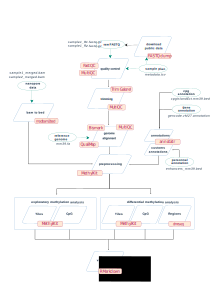

# Methylator, a DNA methylation analysis workflow

<small>Maintained by [BiBs](mailto:bibsATparisepigenetics.com). Last update : 25/04/2024. Methylator v0.1. </small>  

Methylator is a complete Snakemake workflow to analyse DNA methylation data. Methylator runs in a dedicated Apptainer image to allow for reproducibility and was optimized to compute effciently the data on HPC clusters such as the ones from the IFB and iPOP-UP networks. We aim to make those complex analyses do able by biologists with no or little bioinformatics background.

!!! warning
    This is a BETA version of the workflow, and of this documentation! There is no guarantee!

!!! warning 
    If you use this workflow to analyse your data, don't forget to **acknowledge BiBs** in all your communications ! 

!!! quote EDC people
We thank the Bioinformatics and Biostatistics Core Facility, Paris Epigenetics and Cell Fate Center for bioinformatics support.

!!! quote External users 
We thank the Bioinformatics and Biostatistics Core Facility, Paris Epigenetics and Cell Fate Center for sharing their analysis workflows.

Methylator Schema 

Implemented by [BiBs-EDC](https://parisepigenetics.github.io/bibs/), this workflow for DNA methylation data analysis runs effectively on both IFB and iPOP-UP clusters. If you encounter troubles or need additional tools or features, you can create an issue on the [GitHub repository](https://github.com/parisepigenetics/Methylator/issues), email directly [BiBs](mailto:bibsATparisepigenetics.com), or pass by the 366b room.
