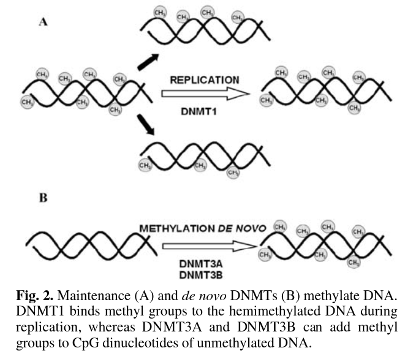

# Quick start with the test dataset

Before running your analyses you can use the test dataset to make and check your installation. 
First copy the configuration file corresponding to the test. 
```
[username@clust-slurm-client Methylator]$ cp TestDataset/configs/config_main.yaml configs/
```
Then start the workflow. 
```
[username@clust-slurm-client Methylator]$ sbatch Workflow.sh wgbs
```

This will run the quality control of the raw FASTQ. See [FASTQ quality control](#fastq-quality-control) for detailed explanations. If everything goes find you will see the results in `TestDataset/results/Test1/fastqc`. See also [how to follow your jobs](#how-to-follow-your-jobs) to know how to check that the run went fine.  
You can now move on with your own data, or run the rest of the workflow on the test dataset. To do so you have to modify `configs/config_main.yaml` turning `QC` entry from "yes" to "no". If you don't know how to do that, see [Preparing the run](preparing_run.md). Then restart the workflow. 

```
[username@clust-slurm-client Methylator]$ sbatch Workflow.sh wgbs
```
Detailed explanation of the outputs are available in [Results](results.md). 

!!! info inline
    The test dataset is taken from the publication:   
    [Genome-wide analysis in the mouse embryo reveals the importance of DNA methylation for transcription integrity](https://www.nature.com/articles/s41467-020-16919-w).   
    This study investigates (by WGBS) the impact of DNA methyltransferases depletion on the mouse methylome. The three biological conditions are :                                 
    - WT  (Wild Type)    
    - 1KO (simple Knock-Out of DNMT1)    
    - DKO (double Knock-Out of DNMT3A/B)   
    The dataset was reduced to a portion of chromsome 19.    

<figure markdown="span">
    { align=right width=325 height=175 } 
</figure> 
