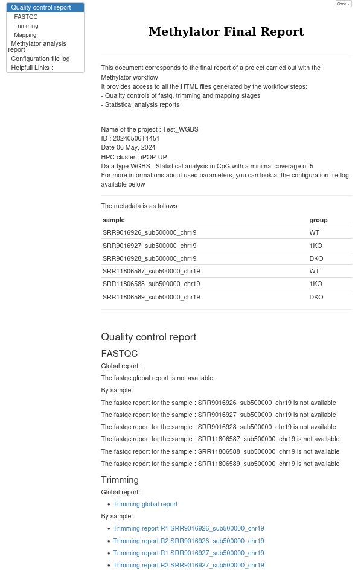
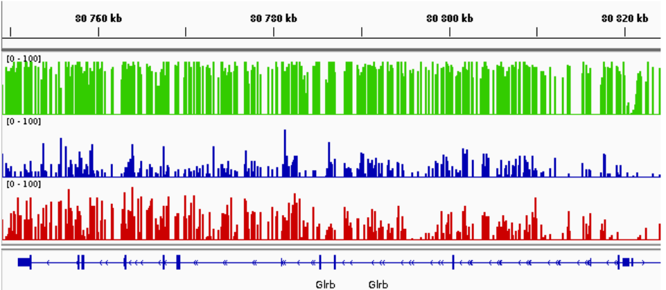
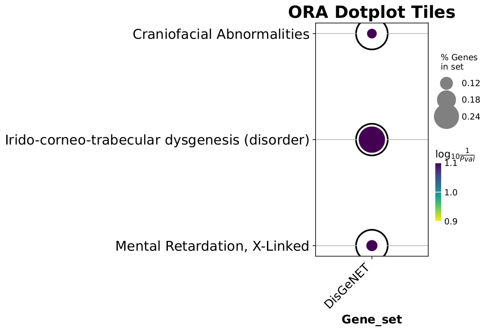

# Workflow results

!!! example
    All the figures and graphs shown as examples were obtained by running Methylator with the test [dataset](quick_start.md). The parameters used to produce the results are the default settings in the configuration file. All analysis reports in HTML format are available here.


The results are separated into two folders :

* the big files : trimmed FASTQ, BAM files, RData objects are in the data folder defined in `configs/config_main.yaml` at `BIGDATAPATH`

```yaml
## paths for intermediate and final results
BIGDATAPATH: /shared/projects/YourProjectName/Methylator/Big_Data # for big files
```

```
[username@clust-slurm-client Methylator]$ tree -L 2 Big_Data/EXAMPLE/
Big_Data/EXAMPLE/
.
├── Annotation
│   └── Annotatr.RData
├── hg38.chrom_sizes
├── mapping_BOWTIE2
│   ├── bam_byName
│   ├── bismark_genome
│   ├── chrom.sizes
│   ├── Deduplicate
│   └── Meth_Extractor
├── Methylator_WGBS
│   └── Rdata
└── trimmed
    ├── SRR1067571_R1_clean_fastqc.html
    ├── SRR1067571_R1_clean_fastqc.zip
    ├── SRR1067571_R1_clean.fastq.gz
    ├── SRR1067571_R1.fastq.gz_trimming_report.txt
    ├── SRR1067571_R2_clean_fastqc.html
    ├── SRR1067571_R2_clean_fastqc.zip
    ├── SRR1067571_R2_clean.fastq.gz
    ├── SRR1067571_R2.fastq.gz_trimming_report.txt
    ...
```

* the small files: QC reports, BigWig, Analysis reports, etc. are in the final result folder defined in `configs/config_main.yaml` at `RESULTPATH`


```yaml
RESULTPATH: /shared/projects/YourProjectName/Methylator/Results
```

```bash
[username@clust-slurm-client Methylator]$ tree -L 2 Results/EXAMPLE/
.
├── logs
│   ├── 20231120T1447_configuration.txt
│   ├── 20231120T1447_free_disk.txt
│   ├── 20231120T1447_mapping.txt
│   ├── 20231120T1447_running_time.txt
│   ├── 20231120T1447_trim_report.txt
│   ├── 20231120T1447_trim.txt
|   |    ... 
├── mapping_BOWTIE2
│   ├── alignmentQC
│   ├── BigWig
│   ├── bismark_summary_report.html
│   ├── bismark_summary_report.txt
│   ├── mapping_report_SRR11806587_sub500000_chr19.html
│   ├── mapping_report_SRR11806588_sub500000_chr19.html
|   |   ... 
│   └── multiqc
├── Methylator_WGBS
│   ├── Annotatr.log
│   └── CpG_mincov5
└── trimmed
    ├── fastqc_trimming
    └── trimming
```

This way you can **get all the results** on your computer by running (from your computer):

```
You@YourComputer:~$ scp -pr username@core.cluster.france-bioinformatique.fr:/shared/projects/YourProjectName/Methylator/results/EXAMPLE/ PathTo/WhereYouWantToSave/
```

and the huge files will stay on the server. You can of course download them as well if you have space (and this is recommended for the long term). 

## Final report

A report named as `20210727T1030_report.html` summarizes your experiment and your results. You'll find links to fastQC results, to mapping quality report, to exploratory analysis of all the samples, to pairwise differential methylation analyses and finally to ORA analyses. They are very helpful to dig into the results. 

A compressed archive named `20210727T1030_report.tar.bz2` is also generated and contains the report and the targets of the different links, excluding big files to make it small enough to be sent to your collaborators. 

```bash
[username@clust-slurm-client Methylator]$ tree -L 2 Results/EXAMPLE/20210727T1030_project_name_report

20240506T1451_project_name_report
├── 1KO_DKO_5mC.html
├── 1KO_DKO_DMR.html
├── bismark_summary_report.html
├── Exploration_5mC.html
├── final_report_Test_WGBS.html
├── report_mapping_bismark.html
├── report_quality_control_after_trimming.html
├── SRR11806587_sub500000_chr19_R1_clean_fastqc.html
├── SRR11806587_sub500000_chr19_R2_clean_fastqc.html
├── SRR11806588_sub500000_chr19_R1_clean_fastqc.html
├── SRR11806588_sub500000_chr19_R2_clean_fastqc.html
├── SRR11806589_sub500000_chr19_R1_clean_fastqc.html
├── SRR11806589_sub500000_chr19_R2_clean_fastqc.html
├── SRR9016926_sub500000_chr19_R1_clean_fastqc.html
├── SRR9016926_sub500000_chr19_R2_clean_fastqc.html
├── SRR9016927_sub500000_chr19_R1_clean_fastqc.html
├── SRR9016927_sub500000_chr19_R2_clean_fastqc.html
├── SRR9016928_sub500000_chr19_R1_clean_fastqc.html
├── SRR9016928_sub500000_chr19_R2_clean_fastqc.html
├── WT_1KO_5mC.html
├── WT_1KO_DMR.html
├── WT_DKO_5mC.html
└── WT_DKO_DMR.html

```

!!! tip "Tip for Windows users"
    Unlike Linux and Mac, the `tar.bz2` format is not natively supported by Windows, but you can use the free [PeaZip](https://peazip.github.io/) or [7-zip](https://www.7-zip.org/) softwares to decompress the `xxx_report.tar.bz2` archive.
    
The final report look like thise : 

<div style="display: flex; justify-content: center;">
    
    
</div>

Detailed description of all the outputs of the workflow is included below. 

## Trimmed reads
After trimming, the FASTQ are stored in the data folder defined in `configs/config_main.yaml` at `BIGDATAPATH:`.   
In this examples the trim FASTQ files will be stored in `/shared/projects/YourProjectName/Methylator/data/EXAMPLE/trim/`.   
They are named :

* Sample1_R1_val_1.fq
* Sample1_R2_val_2.fq   

### Trimming report
In `results/EXAMPLE/trimming` you'll find trimming reports such as `Sample1_forward.fastq.gz_trimming_report.txt` for each samples. You'll find information about the tools and parameters, as well as trimming statistics:

```
SUMMARISING RUN PARAMETERS
==========================
Input filename: /shared/projects/wgbs_flow/Nanopore_data/ONT_data/rrms_2022.07/bisulfite/raw_data/COLO1_R1.fq.gz
Trimming mode: paired-end
Trim Galore version: 0.6.7
Cutadapt version: 4.2
Python version: could not detect
Number of cores used for trimming: 4
Quality Phred score cutoff: 28
Quality encoding type selected: ASCII+33
Using Illumina adapter for trimming (count: 37651). Second best hit was Nextera (count: 0)
Adapter sequence: 'AGATCGGAAGAGC' (Illumina TruSeq, Sanger iPCR; auto-detected)
Maximum trimming error rate: 0.1 (default)
Minimum required adapter overlap (stringency): 1 bp
Minimum required sequence length for both reads before a sequence pair gets removed: 20 bp
All Read 1 sequences will be trimmed by 10 bp from their 5' end to avoid poor qualities or biases
All Read 2 sequences will be trimmed by 10 bp from their 5' end to avoid poor qualities or biases (e.g. M-bias for BS-Seq applications)
All Read 1 sequences will be trimmed by 9 bp from their 3' end to avoid poor qualities or biases
All Read 2 sequences will be trimmed by 9 bp from their 3' end to avoid poor qualities or biases
Running FastQC on the data once trimming has completed
Output file will be GZIP compressed


This is cutadapt 4.2 with Python 3.7.12
Command line parameters: -j 4 -e 0.1 -q 28 -O 1 -a AGATCGGAAGAGC /shared/projects/wgbs_flow/Nanopore_data/ONT_data/rrms_2022.07/bisulfite/raw_data/COLO1_R1.fq.gz
Processing single-end reads on 4 cores ...
Finished in 148.610 s (3.960 µs/read; 15.15 M reads/minute).

=== Summary ===

Total reads processed:              37,527,910
Reads with adapters:                19,815,625 (52.8%)
Reads written (passing filters):    37,527,910 (100.0%)

Total basepairs processed: 1,876,395,500 bp
Quality-trimmed:              11,610,210 bp (0.6%)
Total written (filtered):  1,798,598,760 bp (95.9%)

=== Adapter 1 ===

Sequence: AGATCGGAAGAGC; Type: regular 3'; Length: 13; Trimmed: 19815625 times

Minimum overlap: 1
No. of allowed errors:
1-9 bp: 0; 10-13 bp: 1

Bases preceding removed adapters:
  A: 49.8%
  C: 24.1%
  G: 13.9%
  T: 12.2%
  none/other: 0.0%

Overview of removed sequences
length	count	expect	max.err	error counts
1	14655096	9381977.5	0	14655096
2	252919	2345494.4	0	252919
3	408890	586373.6	0	408890
[...]

RUN STATISTICS FOR INPUT FILE: /shared/projects/wgbs_flow/Nanopore_data/ONT_data/rrms_2022.07/bisulfite/raw_data/COLO1_R1.fq.gz
=============================================
37527910 sequences processed in total
```

This information is summarized in the MultiQC report, see  below. 

### FastQC of trimmed reads
After the trimming, fastQC is automatically run on the new FASTQ and the results are also in the folder `results/EXAMPLE/fastqc_trimming/`:   

- Sample1_R1_trimmed_fastqc.html    
- Sample1_R1_trimmed_fastqc.zip    
- Sample1_R2_trimmed_fastqc.html    
- Sample1_R2_trimmed_fastqc.zip    

As previously **MultiQC** gives a summary for all the samples :  `results/EXAMPLE/fastqc_trimming/report_quality_control_after_trimming.html`.   
You'll find information from the trimming report (for instance you can rapidly see the % of trim reads for the different samples) as well as from fastQC.   
It is included in the final report (ie `????.html`). 

## Mapped reads
The mapped reads are stored as deduplicated, sorted bam in the data folder, in our example in `Big_Data/EXAMPLE/mapping_BOWTIE2/Deduplicate/`, together with their `.bai` index. They can be visualized using a genome browser such as [IGV](http://software.broadinstitute.org/software/igv/home) but this is not very convenient as the files are heavy. [BigWig](https://deeptools.readthedocs.io/en/develop/content/tools/bamCoverage.html) files, that summarize the information converting the individual read positions into a number of reads per bin of a given size, are more adapted. 

## BigWig
To facilitate visualization on a genome browser, [BigWig](https://deeptools.readthedocs.io/en/develop/content/tools/bamCoverage.html) files are generated.
Pour chaque échantillon un bigwig de couverture et de pourcentage de méthylation est crée :

- {SAMPLE_NAME}_5mC_MethCov.bw
- {SAMPLE_NAME}_5mC_MethPerc.bw

Les filtres utilisés pour générer les BigWig sont ceux du fichier de configuration :

```ymal
# ===== Exploratory analysis ===== #
## params 
MINCOV: 5  # int, minimum coverage depth for the analysis
COV.PERC: 99.9 # to the coverage filter, choose the percentile for remove top ..% (MKit_diff_bed.R and MKit_Exploration.Rmd)
MINQUALI: 20  # int, minimum quality to keep a CPG for the analysis
```
If not already done, you can specifically get the BigWig files on your computer running:

```
You@YourComputer:~$ scp -pr username@core.cluster.france-bioinformatique.fr:/shared/projects/YourProjectName/Methylator/??????, PathTo/WhereYouWantToSave/
```

Snapshot of BigWig tracks visualized on [IGV](http://software.broadinstitute.org/software/igv/home).
In this example, green sample correpond to the WT condition, blue sample to the simple KO and red to the double KO. 

 


## Mapping QC
[Qualimap](http://qualimap.bioinfo.cipf.es/) is used to check the mapping quality. You'll find qualimap reports in `Results/EXAMPLE/mapping_BOWTIE2/alignmentQC`. Those reports contain a lot of information:   

- information about the mapper    
- number and % of mapped reads/pairs    
- number of indels and mismatches    
- coverage per chromosome    
- insert size histogram    
- ...  

Once again **MultiQC** aggregates the results of all the samples and you can have a quick overview by looking at `Results/EXAMPLE/mapping_BOWTIE2/multiqc/report_mapping_bismark.html` or in the final report (ie `????_report.html`). 

# Statisical analysis results 

All files of the staticticals analysis are in `Results/EXAMPLE/Methylator_{DATATYPE}/{LEVEL}_mincov{MINCOV}/`  
**DATATYPE** corresponding to the type of data ( : WGBS, RRBS or NANOPORE).     
**LEVEL** corresponding to the level of analysis (per base or tiles).   
And **MINCOV** corresponding at the minimum of coverage choose for retain CpG.      

!!! note 
    So, with the same samples, if you change this parameters to perform a new analysis a new folder is created for don't overwrite laste files. 

## Exploratory methylation analysis results

Exploratory methylation results are in `Results/EXAMPLE/Methylator_{DATATYPE}/{LEVEL}_mincov{MINCOV}/exploratory/`
This folder contain :    

- a HTML report file    
- a folder `Exploration_5mC_files/figure-html` avec toutes les figures généré par le rapport au format .PNG


## Differential methylation CpG or Tiles (DMC/DMT) results

Differential methylation results are in `Results/EXAMPLE/Methylator_{DATATYPE}/{LEVEL}_mincov{MINCOV}/differential/`  
This folder contain :    

- a HTML report file for each comparison (indicate in the config file)    
- a bed folder for each comparisons with :
  
- - a bed file for all DMC/DMT    
- - a bed file for significants DMC or DMT    
- - a bed file for hyper-methylated significants DMC or DMT    
- - a bed file for hypo-methylated significants DMC or DMT       


!!! warning 
    Chaque bed est généré pour chaque combinaisons de valeurs des listes LIST_DIFF et LIST_QV. Ainsi si la liste LIST_DIFF comporte 4 valeurs seuils et la LIST_QV 4 valeurs seuils, on va généré 16 x les fichiers bed pour chacune des conditions, soient 16x4x3 = 192 bedgraphes !!! 


## Differential methylation (DMR only) results

Differential methylation results are in `Results/EXAMPLE/Methylator_{DATATYPE}/{LEVEL}_mincov{MINCOV}/DMR/`  
This folder contain for each comparison a folder with :   

- a HTML report file  (indicate in the config file)    
- a CSV file with all DMRs detected    
- a CSV file with only significant DMRs    
- a CSV file with only significant DMRS associate with genes annotations    


## Over-representation analysis (ORA)

ORA results are in `Results/EXAMPLE/Methylator_{DATATYPE}/{LEVEL}_mincov{MINCOV}/ORA/`   
    
This folder contain :   

- a folder `log`

And for each comparaison :

- a file `barplot_{LEVEL}_{COMPARISON}_{5mc/5hmc}.pdf`   
- a file `dotplot_{LEVEL}_{COMPARISON}_{5mc/5hmc}.pdf`

**Examle of ORA figures**


!!! note
    All this HTML files are included in the [final report](#final-report). 


